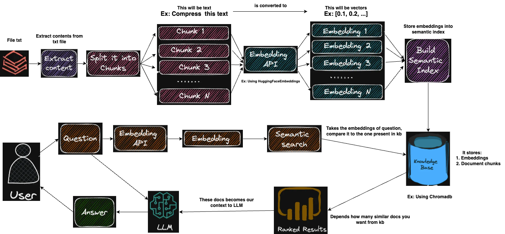
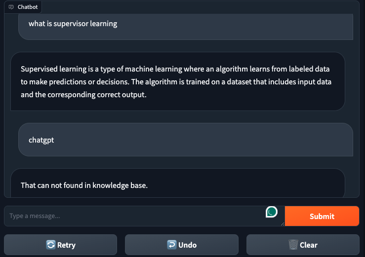

# DocsBot-AI
Create your own Chatbot (ChatGPT) with your documents using Langchain and Gradio. 
This also uses:
- HuggingFaceEmbeddings for embeddings
- ChromaDB for a vectorstore
- OpenAI for a text generation model

I'm serving chatbot on Google Colab, you can try running it here [DocsBot_GoogleColab](DocsBot_colab.ipynb)

# High level architecture of Chatbot


# How it works
- ```ingest.py``` uses LangChain tools to parse the document and create embeddings ```HuggingFaceEmbeddings```. It then stores the result in a vector database using ```Chroma``` vector store.
- ```myGPT.py``` using ChatOpenAI understand questions and create answers. The context for the answers is extracted from the vector store using a similarity search to locate the right piece of context from the docs.
- Only respond to the content in the uploaded documents. If the question is beyond the documents, respond: 'That can not found in knowledge base'.

# Environment Setup
## Python version
To use this software, you must have Python 3.10.0 or later installed. Earlier versions of Python will not compile.

In this repo, I use python version 3.10.12

## Setup
In order to set your environment up to run the code here, first install all requirements:

```
pip install -r requirements.txt
```

## Instructions for ingesting your own dataset
Put any and all your files into the ```source_documents``` directory

# How to run
## Ingest data
After setting up your environment, run the following command to ingest all the data. 
```
python ingest.py
```
It will create an index containing the local vectorstore. Will take time, depending on the size of your documents. You can ingest as many documents as you want, and all will be accumulated in the local embeddings database. If you want to start from an empty database, delete the ```index```.
## Ask questions to your documents using Gradio UI
Before running the **myGPT.py** file, please replace 'YOUR_OPENAI_API_KEY' in the **myGPT.py** file with your OpenAI API Key

In order to ask a question, run a command like:
```
python myGPT.py
```
Enter your Query in TextBox and Hit enter. Wait while the LLM model consumes the prompt and prepares the answer, show your query and answer below TextBox. as show in below figure.




